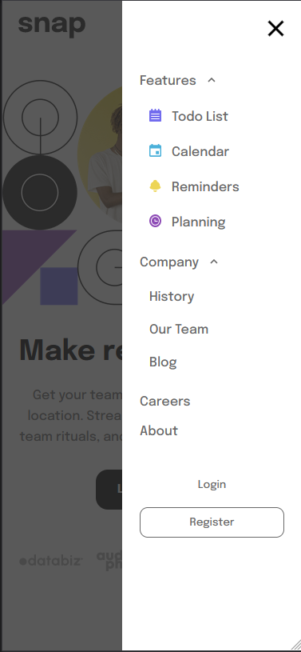

# Frontend Mentor Responsive HTML-CSS-JS - Intro section with dropdown navigation solution

This is a solution to the [Intro section with dropdown navigation challenge on Frontend Mentor](https://www.frontendmentor.io/challenges/intro-section-with-dropdown-navigation-ryaPetHE5). 

## Table of contents

- [Overview](#overview)
  - [The challenge](#the-challenge)
  - [Screenshot](#screenshot)
  - [Links](#links)
- [My process](#my-process)
  - [Built with](#built-with)
- [Author](#author)

## Overview

### The challenge

Users should be able to:

- View the relevant dropdown menus on desktop and mobile when interacting with the navigation links - status = (✔)
- View the optimal layout for the content depending on their device's screen size - status = (✔)
- See hover states for all interactive elements on the page - status = (✔)

### Screenshot

### Links

- Live Site URL: [Watch it live](https://intro-section-with-dropdown-navigation-nine.vercel.app/)
- Solution URL: [Compare design vs final version here](https://www.frontendmentor.io/solutions/responsive-htmlcssjs-intro-section-with-dropdown-navigation-boSPDjWJrE)

## My process

### Built with

- Semantic HTML5 markup
- CSS custom properties
- Flexbox
- CSS Grid
- Mobile-first workflow

## Author

- Frontend Mentor - [@HugoMoncada](https://www.frontendmentor.io/profile/HugoMoncada)

